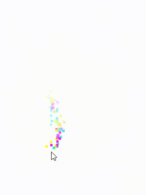

# Amaz-Background  
##### *Web page background widget based on HTML5 Canvas which enables your cursor with a colorful tail* #####  
### Usage ###
Import amazbackground.js as a script file to your html document. Then initialize with following code:

### To customize your configure ###

Where variable *document.AB* is defined in .js file, and method *document.AB.init* is the initialization, and function *document.AB.cfg* is the configuration in which customized settings could be set.  
for more information, please my git or visit my [website](http://www.axeswp.cn).  
*preview cap.gif*  

